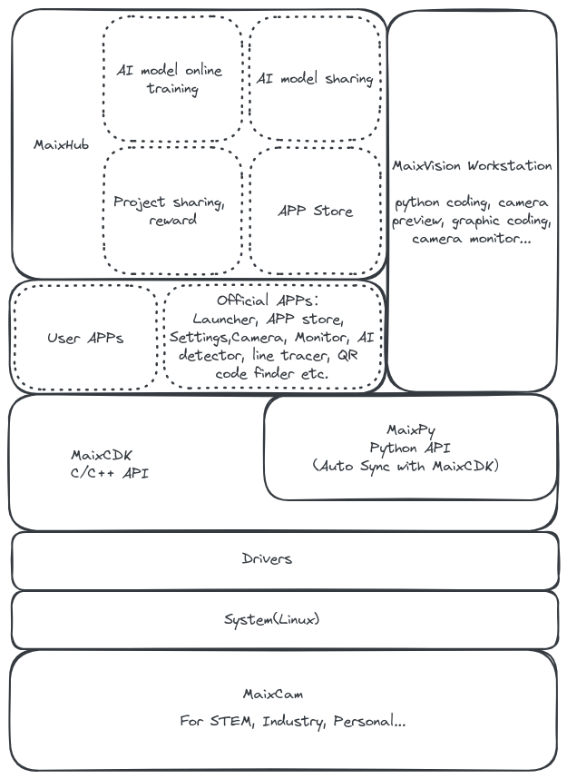

MaixPy
======

English | [中文](./README_ZH.md)

**Let's Sipeed up, Maximize AI's power!**

**MaixPy (v4) provide a super easy way to develop AI vision projects with Python script**.
So you can easily use camera, screen and AI like this:

```python
from maix import camera, display, image
from maix.nn import Classifier

classifier = Classifier(model="mobilenetv2.mud")
input_size = classifier.input_size()
cam = camera.Camera(input_size[0], input_size[1])
dis = display.Display()

while 1:
    img = cam.read()
    res = classifier.classify(img)
    msg = f"{res[0][1]:.2f}: {classifier.labels[res[0][0]]}"
    img.draw_string(10, 10, msg, image.COLOR_RED)
    dis.show(img)
```
> This program read image from camera, and classify what it is by mobilenetv2 model, then show the result on screen.

And we provide several cool hardware platforms:

| Platform | Picture | Description | Price | Buy |
| -------- | ------- | ----------- | ----- | --- |
|  MaixCam |  | - 1Tops@INT8 NPU, support BF16<br>- 1GHz RISC-V(Linux) + 700MHz RISCV-V(RTOS) + 25~300MHz 8051(LowPower)<br>- 256MB DDR3<br>- USB2.0/100M Eth/WiFi6/BLE5.4/H.264/H.265/IIC/PWM/SPI/UART...<br>- 5M Camera/2K encoder/Max 1080p screen| ￥50 ~ ￥300 | To be on sale |

> **Maix-I K210** series is outdated, Not support MaixPy v4, use it please visit **[MaixPy-v1](https://github.com/sipeed/maixpy-v1)**


## Features

| Feature | Description | Picture/Video |
| ------- | ----------- | ------------- |
| Python support | Support Python and common libs like numpy, opencv. | - |
| Simple API | Provide simple API to access hardware, like camera, screen, NPU, etc.<br>And Simple API to create vision apps. | - |
| Many official APPs | Provide many official APPs, like `AI object detection`, `Video Streaming` etc.  | - |
| Easy to start | Use APPs even you don't know how to program. | - |
| As module | Use this as serial module, control it by command. | - |
| MaixVision workstation | A PC software to programming and more.| - |
| APP Store | Share your APPs to community, and install APP in one click. | - |

## Applications (part of them)

| Feature | Description | Picture/Video |
| ------- | ----------- | ------------- |
| AI classification | Classify objects use AI | - |
| AI object detection | Detect objects use AI | - |
| AI face recognition | Recognize faces use AI | - |
| AI Monitor | Security monitor, streaming video and detect objects. Even broadcast to live platforms like bilibili.com | - |
| AI object tracking | Track objects use AI | - |
| Find color | Find color | - |
| Route tracking | Track route | - |
| Face Tracking | Track face| - |
| OCR | Recognize text and numbers | - |
| QR code | Recognize QR code | - |
| Desktop monitor | Monitor PC info, like CPU, memory, network, etc. | - |
| Wether station | Monitor wether info, like temperature, humidity, etc. | - |


## Maix Ecosystem




## Who is using MaixPy?

* AI programmer who want to develop your AI model to embedded devices.
> MaixPy provide easy-to-use API to access NPU, and docs to help you develop your AI model.
* STEM teacher who want to teach AI to students.
> MaixPy provide easy-to-use API, let you focus on teaching AI, not the hardware and complicated software usage.
* Maker who want to make some cool projects but don't want to learn complicated hardware and software.
> MaixPy provide Python API, so all you need is learn Python, and MaixPy's API is so easy to use, you can make your project even in a few minutes.
* Engineer who want to make some projects but want a prototype as soon as possible.
> MaixPy is easy to build projects, and provide corresponding C++ sdk, so you can directly use MaixPy to deploy or transfer Python code to C++ in a few minutes.
* Students who want to learn AI, embedded devices.
> We provide many docs and tutorials to help you find learning route, and grow up step by step. From simple Python programming to AI, to complex embedded system development.
* Enterprise who want to develop AI vision products but have no time or engineers to develop complicated embedded system.
> Use MaixPy even graphic programming to develop your products with no more employees and time. For example, add a AI QA system to your production line, or add a AI security monitor to your office as your demand.

## Get Started

Please visit [Quick Start doc](https://wiki.sipeed.com/maixpy/en/quick_start.html) to get started.

Full Documentation: [wiki.sipeed.com/maixpy](https://wiki.sipeed.com/maixpy)

## FAQ

* What difference between MaixPy v1, MaixPy3 and MaixPy v4?
> * MaixPy v1 use MicroPython programming language, only support Sipeed Maix-I K210 series hardware.
> * MaixPy3 is designed for Sipeed Maix-II-Dock v831, not a long-term support version.
> * MaixPy v4 use Python programming language, support new hardware platforms of Sipeed, it's a long-term support version, the future's hardware platforms will support this version.
>
> (MaixPy v4 Will not support Maix-I K210 series, if you are using Maix-I K210 series, it's recommended to upgrade hardware platform to use this to get more features and better performance.)

More FAQ visit [wiki.sipeed.com/maixpy/faq](https://wiki.sipeed.com/maixpy/faq.html)


## License

All files in this repository are under the terms of the [Apache License 2.0 Sipeed Ltd.](./LICENSE) except the third-party libraries or have their own license.


## Community

* Project sharing: [maixhub.com/share](https://maixhub.com/share)
* Discussion: [maixhub.com/discussion](https://maixhub.com/discussion)
* QQ group: 862340358


