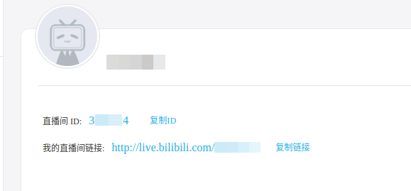

## Introduction

This document provides methods for pushing H264 video streams via RTMP

## How to use

The following example shows pushing an h264 video stream to `rtmp://192.168.0.30:1935/live/stream`

```python
from maix import camera, time, rtmp, image

cam = camera.Camera(640, 480, image.Format.FMT_YVU420SP)

# rtmp://192.168.0.30:1935/live/stream
host = '192.168.0.30'
port = 1935
app = 'live'
stream = 'stream'
bitrate = 1000_000
r = rtmp.Rtmp(host, port, app, stream, bitrate)
r.bind_camera(cam)
r.start()

while True:
    time.sleep(1)
```

Steps:

1. Import the camera、rtmp、time and image modules:

   ```python
   from maix import camera, time, rtmp, image
   ```

2. Initialize the camera:

   ```python
   cam = camera.Camera(640, 480, image.Format.FMT_YVU420SP) # Initialise camera, output resolution 640x480 NV21 format
   ```

   - Note that the RTMP module currently only supports the NV21 format, so the camera needs to be configured to output in NV21 format.


3. Initialise and start the Rtmp object

   ```python
   r = rtmp.Rtmp(host, port, app, stream, bitrate)
   r.bind_camera(cam)
   r.start()
   ```

   - `r = rtmp.Rtmp(host, port, app, stream, bitrate)` is used to create an `Rtmp` object, where `host` refers to the ip address or domain of the rtmp server, `app` refers to the name of the application that is open to the rtmp server, and `stream` refers to the name of the rtmp stream, which can also be used as the key for pushing the stream
   - `r.bind_camera(cam)` is used to bind a `Camera` object, the original `Camera` object can not be used after binding.
   - `r.start()` is used to start the `rtmp` stream.

4. Done

## Push streaming test to Bilibili

### Launch bilibili live stream

1. Click on Live Streaming

   


2. Click on Live Streaming Settings


3. Find the live streaming address



4. Scroll down, select a category, and click Start Live!


5. Get the push stream address


- server address: `rtmp://live-push.bilivideo.com/live-bvc`
- key：`?streamname=live_xxxx&key=1fbfxxxxxxxxxxxxxffe0&schedule=rtmp&pflag=1`

Push stream address: `rtmp://live-push.bilivideo.com/live-bvc/?streamname=live_xxxx&key=1fbfxxxxxxxxxxxxxffe0&schedule=rtmp&pflag=1`


### Run the RTMP client

```python
from maix import camera, time, rtmp, image

cam = camera.Camera(640, 480, image.Format.FMT_YVU420SP)

# rtmp://live-push.bilivideo.com/live-bvc/?streamname=live_xxxx&key=1fbfxxxxxxxxxxxxxffe0&schedule=rtmp&pflag=1
host = 'live-push.bilivideo.com'
port = 1935
app = 'live-bvc'
stream = '?streamname=live_xxxx&key=1fbfxxxxxxxxxxxxxffe0&schedule=rtmp&pflag=1'
bitrate = 1000_000
r = rtmp.Rtmp(host, port, app, stream, bitrate)
r.bind_camera(cam)
r.start()

while True:
    time.sleep(1)
```

Above get bilibili's push stream address as `rtmp://live-push.bilivideo.com/live-bvc/?streamname=live_xxxx&key=1fbfxxxxxxxxxxxxxffe0&schedule=rtmp&pflag=1`

Can be detached:

1. server address is `live-push.bilivideo.com`
2. port is `1935`, if there is no port number, the default is `1935`
3. application name is `live-bvc`
4. stream name is `?streamname=live_xxxx&key=1fbfxxxxxxxxxxxxxffe0&schedule=rtmp&pflag=1`

Run the code and you will be able to see the `maixcam` screen in the live stream, if you find that the live stream is not displayed, try to close the live stream first, then reopen it and run the code again.

Try it~!