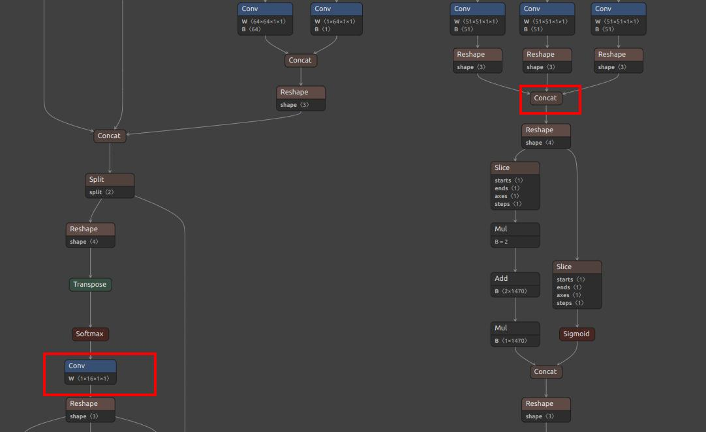
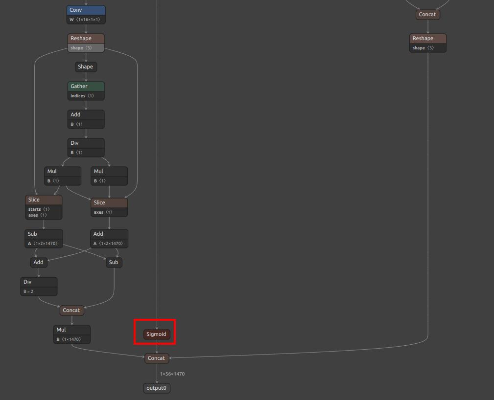

## Introduction

The default official model provides detection for 80 types of objects. If this does not meet your needs, you can train your own detection objects by setting up a training environment on your computer or server.

YOLOv8 supports not only object detection but also keypoint detection with yolov8-pose. Besides the official human keypoints, you can create your own keypoint dataset to train and detect specified objects and keypoints.

**Note:** This article explains how to customize training, but some basic knowledge is assumed. If you do not have this knowledge, please learn it yourself:
* This article will not explain how to install the training environment. Please search and install it yourself (Pytorch environment installation) and test it.
* This article will not explain the basic concepts of machine learning or basic Linux usage knowledge.

If you think there is something in this article that needs improvement, feel free to click `Edit this article` in the upper right corner to contribute and submit a documentation PR.

## Process and Goals of this Article

To use our model on MaixPy (MaixCAM), the following process is required:
* Set up the training environment (this is not covered in this article, please search for Pytorch training environment setup).
* Pull the [yolov8](https://github.com/ultralytics/ultralytics) source code to your local machine.
* Prepare the dataset and format it as required by the yolov5 project.
* Train the model to get an `onnx` model file, which is the final output file of this article.
* Convert the `onnx` model to a `MUD` file supported by MaixPy, which is detailed in [MaixCAM Model Conversion](../ai_model_converter/maixcam.md).
* Use MaixPy to load and run the model.

## Reference Articles

Since this is a relatively common operational process, this article only provides an overview. For specific details, you can refer to the **[YOLOv8 official code and documentation](https://github.com/ultralytics/ultralytics)** (**recommended**), and search for training tutorials to ultimately export the onnx file.

If you find any good articles, feel free to modify this article and submit a PR.

## Exporting YOLOv8 ONNX Model

Create an `export_onnx.py` file in the `ultralytics` directory:
```python
from ultralytics import YOLO
import sys

print(sys.path)
net_name = sys.argv[1] # yolov8n.pt yolov8n-pose.pt # https://docs.ultralytics.com/models/yolov8/#supported-tasks-and-modes
input_width = int(sys.argv[2])
input_height = int(sys.argv[3])

# Load a model
model = YOLO(net_name)  # load an official model
# model = YOLO("path/to/best.pt")  # load a custom model

# Predict with the model
results = model("https://ultralytics.com/images/bus.jpg")  # predict on an image
path = model.export(format="onnx", imgsz=[input_width, input_height])  # export the model to ONNX format
print(path)
```

Then execute `python export_onnx.py yolov8n.pt 320 224` to export the `onnx` model. Here, the input resolution is re-specified. The model was trained with `640x640`, but we re-specified the resolution to improve the running speed. The resolution `320x224` is used because it is closer to the MaixCAM screen ratio for better display. You can set it according to your needs.


## Converting to MaixCAM Supported Model and MUD File

MaixPy/MaixCDK currently supports both YOLOv8 detection and YOLOv8-pose human pose keypoint detection (as of 2024.6.21).

Follow [MaixCAM Model Conversion](../ai_model_converter/maixcam.md) for model conversion.

Note the choice of model output nodes:
* For YOLOv8, extract `/model.22/dfl/conv/Conv_output_0,/model.22/Sigmoid_output_0` outputs from the onnx.
* For keypoint detection (yolov8-pose), extract `/model.22/dfl/conv/Conv_output_0,/model.22/Sigmoid_output_0,/model.22/Concat_output_0` outputs from the onnx.

 

For object detection, the mud file is:
```ini
[basic]
type = cvimodel
model = yolov8n.cvimodel

[extra]
model_type = yolov8
input_type = rgb
mean = 0, 0, 0
scale = 0.00392156862745098, 0.00392156862745098, 0.00392156862745098
labels = person, bicycle, car, motorcycle, airplane, bus, train, truck, boat, traffic light, fire hydrant, stop sign, parking meter, bench, bird, cat, dog, horse, sheep, cow, elephant, bear, zebra, giraffe, backpack, umbrella, handbag, tie, suitcase, frisbee, skis, snowboard, sports ball, kite, baseball bat, baseball glove, skateboard, surfboard, tennis racket, bottle, wine glass, cup, fork, knife, spoon, bowl, banana, apple, sandwich, orange, broccoli, carrot, hot dog, pizza, donut, cake, chair, couch, potted plant, bed, dining table, toilet, tv, laptop, mouse, remote, keyboard, cell phone, microwave, oven, toaster, sink, refrigerator, book, clock, vase, scissors, teddy bear, hair drier, toothbrush
```

Replace `labels` according to your training objects.

For keypoint detection (yolov8-pose), the mud file is:
```ini
[basic]
type = cvimodel
model = yolov8n_pose.cvimodel

[extra]
model_type = yolov8
type = pose
input_type = rgb
mean = 0, 0, 0
scale = 0.00392156862745098, 0.00392156862745098, 0.00392156862745098
labels = person
```

The default is human pose keypoint detection, so `labels` has only one `person`. Replace it according to the objects you are detecting.


## Upload share on MaixHub

Share your model on [MaixHub model zoo](https://maixhub.com/model/zoo?platform=maixcam) 上传并分享你的模型，可以多提供几个分辨率供大家选择。


