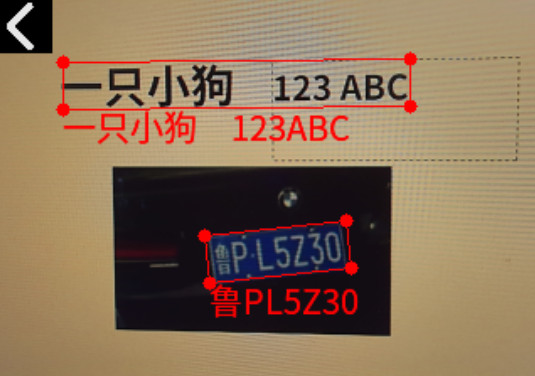

## Introduction to OCR

OCR (Optical Character Recognition) refers to the visual recognition of text in images. It can be applied in various scenarios, such as:
* Recognizing text/numbers on cards
* Extracting text from cards, such as ID cards
* Digitizing paper documents
* Reading digital displays, useful for meter reading and digitizing old instrument data
* License plate recognition

## Using OCR in MaixPy

MaixPy has integrated [PaddleOCR](https://github.com/PaddlePaddle/PaddleOCR), an open-source OCR algorithm developed by Baidu. For understanding the principles, you can refer to this open-source project.



**First, ensure that your MaixPy version is >= 4.6.**

Then, execute the code: (The complete, latest code can be found in the [MaixPy repository](https://github.com/sipeed/MaixPy/blob/main/examples/vision/ai_vision/nn_pp_ocr.py); please refer to the source code.)
```python
from maix import camera, display, image, nn, app

model = "/root/models/pp_ocr.mud"
ocr = nn.PP_OCR(model)

cam = camera.Camera(ocr.input_width(), ocr.input_height(), ocr.input_format())
disp = display.Display()

image.load_font("ppocr", "/maixapp/share/font/ppocr_keys_v1.ttf", size = 20)
image.set_default_font("ppocr")

while not app.need_exit():
    img = cam.read()
    objs = ocr.detect(img)
    for obj in objs:
        points = obj.box.to_list()
        img.draw_keypoints(points, image.COLOR_RED, 4, -1, 1)
        img.draw_string(obj.box.x4, obj.box.y4, obj.char_str(), image.COLOR_RED)
    disp.show(img)
```

You can see that `ocr = nn.PP_OCR(model)` loads the model, and then `ocr.detect(img)` detects and recognizes the text, displaying the results on the screen.

## More Model Options

You can download more complete models with different input resolutions, languages, and versions from the [MaixHub Model Download](https://maixhub.com/model/zoo/449) (MaixPy currently defaults to the pp_ocr.mud model, which uses PPOCRv3 for detection and v4 for recognition).

## Recognizing Without Detection

If you already have a processed image with known coordinates for the four corners of the text, you can skip calling the `detect` function and simply call the `recognize` function. This way, it will only recognize the text in the image without detection.

## Custom Models

The default model provides detection and recognition for Chinese and English text. If you have specific requirements, such as another language or only want to detect certain shapes without recognizing all types of text, you can download the corresponding model from the [PaddleOCR Official Model Library](https://paddlepaddle.github.io/PaddleOCR/ppocr/model_list.html) and convert it to a format supported by MaixCAM.

The most complex part here is converting the model into a format usable by MaixCAM, which is a **relatively complex** process that requires basic Linux skills and adaptability.

* First, either train your model using PaddleOCR source code or download the official models. Choose PP-OCRv3 for detection because it is efficient and faster than v4, and download the v4 model for recognition; tests show that v3 does not perform well when quantized on MaixCAM.
* Then, convert the model to ONNX:
```shell
model_path=./models/ch_PP-OCRv3_rec_infer
paddle2onnx --model_dir ${model_path} --model_filename inference.pdmodel --params_filename inference.pdiparams --save_file ${model_path}/inference.onnx --opset_version 14 --enable_onnx_checker True
```
* Next, set up the environment according to the [ONNX to MUD format model documentation](../ai_model_converter/maixcam.md) and convert the model. Sample conversion scripts are provided in the appendix.
* Finally, load and run it using MaixPy.

## Appendix: Model Conversion Scripts

Detection:
```shell
#!/bin/bash

set -e

net_name=ch_PP_OCRv3_det
input_w=320
input_h=224
output_name=sigmoid_0.tmp_0

# scale 1/255.0
# "mean": [0.485, 0.456, 0.406],
# "std": [0.229, 0.224, 0.225],

# mean: mean * 255
# scale: 1/(std*255)

# mean: 123.675, 116.28, 103.53
# scale: 0.01712475, 0.017507, 0.01742919

mkdir -p workspace
cd workspace

# convert to mlir
model_transform.py \
--model_name ${net_name} \
--model_def ../${net_name}.onnx \
--input_shapes [[1,3,${input_h},${input_w}]] \
--mean "123.675,116.28,103.53" \
--scale "0.01712475,0.017507,0.01742919" \
--keep_aspect_ratio \
--pixel_format bgr \
--channel_format nchw \
--output_names "${output_name}" \
--test_input ../test_images/test3.jpg \
--test_result ${net_name}_top_outputs.npz \
--tolerance 0.99,0.99 \
--mlir ${net_name}.mlir

# export bf16 model
# not use --quant_input, use float32 for easy coding
model_deploy.py \
--mlir ${net_name}.mlir \
--quantize BF16 \
--processor cv181x \
--test_input ${net_name}_in_f32.npz \
--test_reference ${net_name}_top_outputs.npz \
--model ${net_name}_bf16.cvimodel

echo "calibrate for int8 model"
# export int8 model
run_calibration.py ${net_name}.mlir \
--dataset ../images \
--input_num 200 \
-o ${net_name}_cali_table

echo "convert to int8 model"
# export int8 model
# add --quant_input, use int8 for faster processing in maix.nn.NN.forward_image
model_deploy.py \
--mlir ${net_name}.mlir \
--quantize INT8 \
--quant_input \
--calibration_table ${net_name}_cali_table \
--processor cv181x \
--test_input ${net_name}_in_f32.npz \
--test_reference ${net_name}_top_outputs.npz \
--tolerance 0.9,0.5 \
--model ${net_name}_int8.cvimodel
```

Recognition:
```shell
#!/bin/bash

set -e

# net_name=ch_PP_OCRv4_rec
# output_name=softmax_11.tmp_0

net_name=ch_PP_OCRv3_rec_infer_sophgo
output_name=softmax_5.tmp_0

input_w=320
input_h=48
cali_images=../images_crop_320

# scale 1/255.0
# "mean": [0.5, 0.5, 0.5],
# "std": [0.5, 0.5, 0.5],

# mean: mean * 255
# scale: 1/(std*255)

# mean: 127.5,127.5,127.5
# scale: 0.00784313725490196,0.00784313725490196,0.00784313725490196

mkdir -p workspace
cd workspace

# convert to mlir
model_transform.py \
--model_name ${net_name} \
--model_def ../${net_name}.onnx \
--input_shapes [[1,3,${input_h},${input_w}]] \
--mean "127.5,127.5,127.5" \
--scale "0.00784313725490196,0.00784313725490196,0.00784313725490196" \
--keep_aspect_ratio \
--pixel_format bgr \
--channel_format nchw \
--output_names "${output_name}" \
--test_input ../test_images/test3.jpg \
--test_result ${net_name}_top_outputs.npz \
--tolerance 0.99,0.99 \
--mlir ${net_name}.mlir

# export bf16 model
# not use --quant_input, use float32 for easy coding
model_deploy.py \
--mlir ${net_name}.mlir \
--quantize BF16 \
--processor cv181x \
--test_input ${net_name}_in_f32.npz \
--test_reference ${net_name}_top_outputs.npz \
--model ${net_name}_bf16.cvimodel

echo "calibrate for int8 model"
# export int8 model
run_calibration.py ${net_name}.mlir \
--dataset $cali_images \
--input_num 200 \
-o ${net_name}_cali_table

echo "convert to int8 model"
# export int8 model
# add --quant_input, use int8 for faster processing in maix.nn.NN.forward_image
model_deploy.py \
--mlir ${net_name}.mlir \
--quantize INT8 \
--quant_input \
--calibration_table ${net

_name}_cali_table \
--processor cv181x \
--test_input ${net_name}_in_f32.npz \
--test_reference ${net_name}_top_outputs.npz \
--tolerance 0.9,0.5 \
--model ${net_name}_int8.cvimodel
```
