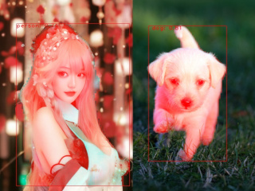

## Introduction

Image semantic segmentation is the process of identifying specific objects in an image and recognizing the pixels of those objects. For example, in the image below, the body parts of a human and a dog are recognized. This can be used for collision detection, autonomous vehicle navigation, area measurement, and more.



## Using Image Semantic Segmentation with MaixPy

MaixPy provides a default model with 80 object classes from the COCO dataset.

> MaixPy version must be >= 4.4.0

The following code can also be found in the [MaixPy examples](https://github.com/sipeed/maixpy/tree/main/examples/).

```python
from maix import camera, display, image, nn, app, time

detector = nn.YOLOv8(model="/root/models/yolov8n_seg.mud", dual_buff = True)

cam = camera.Camera(detector.input_width(), detector.input_height(), detector.input_format())
dis = display.Display()

while not app.need_exit():
    img = cam.read()
    objs = detector.detect(img, conf_th = 0.5, iou_th = 0.45)
    for obj in objs:
        # img.draw_image(obj.x, obj.y, obj.seg_mask)
        detector.draw_seg_mask(img, obj.x, obj.y, obj.seg_mask, threshold=127)
        img.draw_rect(obj.x, obj.y, obj.w, obj.h, color = image.COLOR_RED)
        msg = f'{detector.labels[obj.class_id]}: {obj.score:.2f}'
        img.draw_string(obj.x, obj.y, msg, color = image.COLOR_RED)
    dis.show(img)
```

## Models with Different Resolutions

The default model uses an input resolution of 320x224. For more resolutions, download from the [MaixHub Model Library](https://maixhub.com/model/zoo/413).


## dual_buff Dual Buffer Acceleration

You may have noticed that the model initialization uses `dual_buff` (which defaults to `True`). Enabling the `dual_buff` parameter can improve running efficiency and increase the frame rate. For detailed principles and usage notes, see [dual_buff Introduction](./dual_buff.md).

## Customize Your Own Object Segmentation Model

The provided model has 80 object classes from the COCO dataset. If this does not meet your requirements, you can train your own object detection and segmentation model. Follow the [Offline Training YOLOv8](./customize_model_yolov8.md) guide to use the YOLOv8 official segmentation model training method and then convert it to a format supported by MaixCAM.

