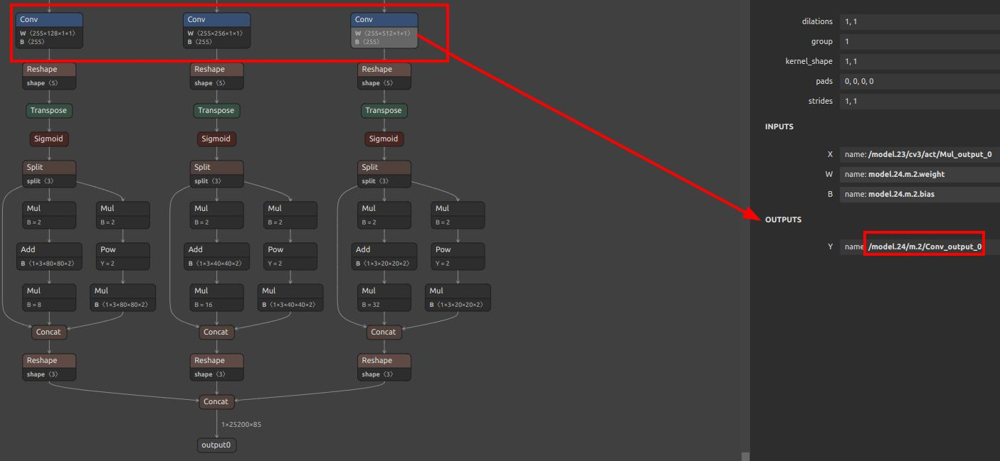

## 简介

电脑上训练的模型不能直接给 MaixCAM 使用，因为 MaixCAM 的硬件性能有限，一般我们需要将模型进行`INT8`量化以减少计算量，并且转换为 MaixCAM 支持的模型格式。

本文介绍如何将 ONNX 模型转换为 MaixCAM 能使用的模型（MUD模型）。


## MaixCAM 支持的模型文件格式

MUD（模型统一描述文件， model universal description file）是 MaixPy 支持的一种模型描述文件，用来统一不同平台的模型文件，方便 MaixPy 代码跨平台，本身是一个 `ini`格式的文本文件，可以使用文本编辑器编辑。
一般 MUD 文件会伴随一个或者多个实际的模型文件，比如对于 MaixCAM， 实际的模型文件是`.cvimodel`格式， MUD 文件则是对它做了一些描述说明。

这里以 `YOLOv8` 模型文件举例，一共两个文件`yolov8n.mud`和`yolov8n.cvimodel`，前者内容：

```ini
[basic]
type = cvimodel
model = yolov8n.cvimodel

[extra]
model_type = yolov8
input_type = rgb
mean = 0, 0, 0
scale = 0.00392156862745098, 0.00392156862745098, 0.00392156862745098
labels = person, bicycle, car, motorcycle, airplane, bus, train, truck, boat, traffic light, fire hydrant, stop sign, parking meter, bench, bird, cat, dog, horse, sheep, cow, elephant, bear, zebra, giraffe, backpack, umbrella, handbag, tie, suitcase, frisbee, skis, snowboard, sports ball, kite, baseball bat, baseball glove, skateboard, surfboard, tennis racket, bottle, wine glass, cup, fork, knife, spoon, bowl, banana, apple, sandwich, orange, broccoli, carrot, hot dog, pizza, donut, cake, chair, couch, potted plant, bed, dining table, toilet, tv, laptop, mouse, remote, keyboard, cell phone, microwave, oven, toaster, sink, refrigerator, book, clock, vase, scissors, teddy bear, hair drier, toothbrush
```

可以看到， 指定了模型类别为`cvimodel`, 模型路径为相对`mud`文件的路径下的`yolov8n.cvimodel`文件；
以及一些需要用到的信息，比如预处理`mean`和`scale`，这里需要和训练的时候对模型输入的数据的预处理方法一致，`labels`则是检测对象的 80 种分类。

实际用这个模型的时候将两个文件放在同一个目录下即可。


## 准备 ONNX 模型

准备好你的 onnx 模型， 然后在[https://netron.app/](https://netron.app/) 查看你的模型，确保你的模型使用的算子在转换工具的支持列表中，转换工具的支持列表可以在[算能 TPU SDK](https://developer.sophgo.com/thread/473.html)的 **CVITEK_TPU_SDK开发指南.pdf** 中看到列表。


## 找出合适的量化输出节点

一般模型都有后处理节点，这部分是 CPU 进行运算的，我们将它们剥离出来，它们会影响到量化效果，可能会导致量化失败。

这里以`YOLOv5 举例`，



可以看到这里有三个`conv`，后面的计算均由 CPU 进行，我们量化时就采取这几个`conv`的输出作为模型的最后输出，在这里输出名分别叫`/model.24/m.0/Conv_output_0,/model.24/m.1/Conv_output_0,/model.24/m.2/Conv_output_0`。


## 安装模型转换环境

模型转换使用算能的[https://github.com/sophgo/tpu-mlir](https://github.com/sophgo/tpu-mlir)，要安装它我们直接在 docker 环境中安装，防止我们电脑的环境不匹配，如果你没用过 docker，可以简单理解成它类似虚拟机。

### 安装 docker

参考[docker 安装官方文档](https://docs.docker.com/engine/install/ubuntu/)安装即可。

比如：
```shell
# 安装docker依赖的基础软件
sudo apt-get update
sudo apt-get install apt-transport-https ca-certificates curl gnupg-agent software-properties-common
# 添加官方来源
curl -fsSL https://download.docker.com/linux/ubuntu/gpg | sudo apt-key add -
sudo add-apt-repository "deb [arch=amd64] https://download.docker.com/linux/ubuntu $(lsb_release -cs) stable"
# 安装 docker
sudo apt-get update
sudo apt-get install docker-ce docker-ce-cli containerd.io
```


### 拉取 docker 镜像

```shell
docker pull sophgo/tpuc_dev:latest
```

如果docker拉取失败，可以通过以下方式进行下载：
```shell
wget https://sophon-file.sophon.cn/sophon-prod-s3/drive/24/06/14/12/sophgo-tpuc_dev-v3.2_191a433358ad.tar.gz
docker load -i sophgo-tpuc_dev-v3.2_191a433358ad.tar.gz
```
这个方法参考[tpu-mlir官方docker环境配置](https://github.com/sophgo/tpu-mlir/blob/master/README_cn.md)。

此外你也可以设置国内的镜像，可自行搜索或者参考[docker 设置代理，以及国内加速镜像设置](https://neucrack.com/p/286)。


### 运行容器

```shell
docker run --privileged --name tpu-env -v /home/$USER/data:/home/$USER/data -it sophgo/tpuc_dev
```

这就起了一个容器，名叫`tpu-env`，并且把本机的`~/data`目录挂载到了容器的`~/data`，这样就实现了文件共享，并且和宿主机路径一致。

下次启动容器用`docker start tpu-env && docker attach tpu-env`即可。


### 安装 tpu-mlir

先到[github](https://github.com/sophgo/tpu-mlir/releases)下载 `whl` 文件，放到`~/data`目录下。
在容器中执行命令安装：
```shell
pip install tpu_mlir*.whl # 这里就是下载文件的名字
```

执行`model_transform.py` 会有打印帮助信息就算是安装成功了。

## 编写转换脚本

转换模型主要就两个命令，`model_transform.py` 和 `model_deploy.py`，主要麻烦的是参数，所以我们写一个脚本`convert_yolov5_to_cvimodel.sh`存下来方便修改。

```shell
#!/bin/bash

set -e

net_name=yolov5s
input_w=640
input_h=640

# mean: 0, 0, 0
# std: 255, 255, 255

# mean
# 1/std

# mean: 0, 0, 0
# scale: 0.00392156862745098, 0.00392156862745098, 0.00392156862745098

mkdir -p workspace
cd workspace

# convert to mlir
model_transform.py \
--model_name ${net_name} \
--model_def ../${net_name}.onnx \
--input_shapes [[1,3,${input_h},${input_w}]] \
--mean "0,0,0" \
--scale "0.00392156862745098,0.00392156862745098,0.00392156862745098" \
--keep_aspect_ratio \
--pixel_format rgb \
--channel_format nchw \
--output_names "/model.24/m.0/Conv_output_0,/model.24/m.1/Conv_output_0,/model.24/m.2/Conv_output_0" \
--test_input ../dog.jpg \
--test_result ${net_name}_top_outputs.npz \
--tolerance 0.99,0.99 \
--mlir ${net_name}.mlir

# export bf16 model
#   not use --quant_input, use float32 for easy coding
model_deploy.py \
--mlir ${net_name}.mlir \
--quantize BF16 \
--processor cv181x \
--test_input ${net_name}_in_f32.npz \
--test_reference ${net_name}_top_outputs.npz \
--model ${net_name}_bf16.cvimodel

echo "calibrate for int8 model"
# export int8 model
run_calibration.py ${net_name}.mlir \
--dataset ../images \
--input_num 200 \
-o ${net_name}_cali_table

echo "convert to int8 model"
# export int8 model
#    add --quant_input, use int8 for faster processing in maix.nn.NN.forward_image
model_deploy.py \
--mlir ${net_name}.mlir \
--quantize INT8 \
--quant_input \
--calibration_table ${net_name}_cali_table \
--processor cv181x \
--test_input ${net_name}_in_f32.npz \
--test_reference ${net_name}_top_outputs.npz \
--tolerance 0.9,0.6 \
--model ${net_name}_int8.cvimodel
```

可以看到，这里有几个比较重要的参数：
* `output_names` 就是我们前面说到的输出节点的输出名。
* `mean, scale` 就是训练时使用的预处理方法，比如 `YOLOv5` 官方代码的预处理是把图像 RGB 3个通道分别 `-mean`再除以`std`，并且默认`mean`
为`0`， `std`为`255`，即将图像的值归一，这里`scale`就是`1/std`。你的模型需要根据实际的预处理方法修改。
* `test_input` 就是转换时用来测试的图像，这里是`../dog.jpg`，所以实际模型转换时我们需要在此脚本所在同目录放一张`dog.jpg`的图，你的模型根据你的实际情况替换图像。
* `tolerance` 就是量化前后允许的误差，如果转换模型时报错提示值小于设置的这个值，说明转出来的模型可能相比 onnx 模型误差较大，如果你能够容忍，可以适当调小这个阈值让模型转换通过，不过大多数时候都是因为模型结构导致的，需要优化模型，以及仔细看后处理，把能去除的后处理去除了。
* `quantize` 即量化的数据类型，在 MaixCAM 上我们一般用 INT8 模型，这里我们虽然也顺便转换了一个 BF16 模型，BF16 模型的好处时精度高，不过运行速率比较慢，能转成 INT8 就推荐先用 INT8,实在不能转换的或者精度要求高速度要求不高的再考虑 BF16。
* `dataset` 表示用来量化的数据集，也是放在转换脚本同目录下，比如这里是`images`文件夹，里面放数据即可，对于 YOLOv5 来说就是图片，从 coco 数据集中复制一部分典型场景的图片过来即可。 用`--input_num` 可以指定实际使用图片的数量（小于等于 images 目录下实际的图片）。

## 执行转换脚本

直接执行`chmod +x convert_yolov5_to_cvimodelsh && ./convert_yolov5_to_cvimodel.sh` 等待转换完成。

如果出错了，请仔细看上一步的说明，是不是参数有问题，或者输出层选择得不合理等。

然后就能在`workspace`文件夹下看到有`**_int8.cvimodel` 文件了。

## 编写`mud`文件

根据你的模型情况修改`mud`文件，对于 YOLOv5 就如下，修改成你训练的`labels`就好了。

```ini
[basic]
type = cvimodel
model = yolov5s.cvimodel

[extra]
model_type = yolov5
input_type = rgb
mean = 0, 0, 0
scale = 0.00392156862745098, 0.00392156862745098, 0.00392156862745098
anchors = 10,13, 16,30, 33,23, 30,61, 62,45, 59,119, 116,90, 156,198, 373,326
labels = person, bicycle, car, motorcycle, airplane, bus, train, truck, boat, traffic light, fire hydrant, stop sign, parking meter, bench, bird, cat, dog, horse, sheep, cow, elephant, bear, zebra, giraffe, backpack, umbrella, handbag, tie, suitcase, frisbee, skis, snowboard, sports ball, kite, baseball bat, baseball glove, skateboard, surfboard, tennis racket, bottle, wine glass, cup, fork, knife, spoon, bowl, banana, apple, sandwich, orange, broccoli, carrot, hot dog, pizza, donut, cake, chair, couch, potted plant, bed, dining table, toilet, tv, laptop, mouse, remote, keyboard, cell phone, microwave, oven, toaster, sink, refrigerator, book, clock, vase, scissors, teddy bear, hair drier, toothbrush
```

这里`basic`部分指定了模型文件类别和模型文件路径，是必要的参数，有了这个参数就能用`MaixPy`或者`MaixCDK`中的`maix.nn.NN`类来加载并运行模型了。


`extra`则根据不同模型的需求设计不同参数。
比如这里对`YOLOv5`设计了这些参数，主要是 预处理、后处理、标签等参数。
对于 `MaixPy` 已经支持了的模型可以直接下载其模型复制修改。
也可以看具体的代码，比如[YOLOv5 的源码](https://github.com/sipeed/MaixCDK/blob/71d5b3980788e6b35514434bd84cd6eeee80d085/components/nn/include/maix_nn_yolov5.hpp#L73-L223)，可以看到源码使用了哪些参数。

比如你用`YOLOv5`训练了检测数字`0~9`的模型，那么需要将`labels`改成`0,1,2,3,4,5,6,7,8,9`，其它参数如果你没改训练代码保持即可。

如果你需要移植 `MaixPy` 没有支持的模型，则可以根据模型的预处理和后处理情况定义 `extra`, 然后编写对应的解码类。如果你不想用C++修改 MaixPy 源码，你也可以用MaixPy 的`maix.nn.NN`类加载模型，然后用 `forward` 或者 `forward_image` 方法或者原始输出，在 Python 层面写后处理也可以，只是运行效率比较低不太推荐。


## 编写后处理代码

如上一步所说，如果是按照已经支持的模型的`mud`文件修改好，那直接调用`MaixPy`或者`MaixCDK`对应的代码加载即可。
如果支持新模型，设计好 `mud` 文件后，你需要实际编写预处理和后处理，有两种方法：
* 一：MaixPy 用 `maix.nn.NN`加载模型，然后`forward`或者`forward_image`函数运行模型，获得输出，然后用 Python 函数编写后处理得到最终结果。
* 二：在`MaixCDK`中，可以参考[YOLOv5 的源码](https://github.com/sipeed/MaixCDK/blob/71d5b3980788e6b35514434bd84cd6eeee80d085/components/nn/include/maix_nn_yolov5.hpp), 新增一个`hpp`文件，增加一个处理你的模型的类，并且修改所有函数和类的`@maixpy`注释，编写好了编译`MaixPy`项目，即可在`MaixPy`中调用新增的类来运行模型了。

支持了新模型后还可以将源码提交（Pull Request）到主`MaixPy`仓库中，成为`MaixPy`项目的一员，为社区做贡献，也可以到 [MaixHub 分享](https://maixhub.com/share) 分享你新支持的模型，根据质量可以获得最少 `30元` 最高 `2000元` 的打赏！


