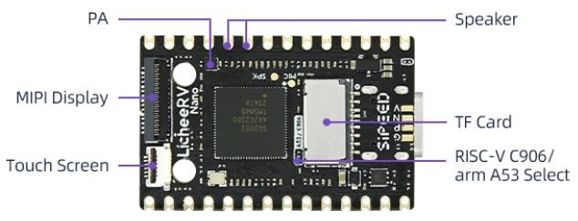

## 简介

本文档提供播放音频的使用方法


## 使用方法

### 硬件操作



`MaixCAM`没有内置喇叭，因此需要自行焊接一个功率在`1W`内的喇叭。喇叭焊接的引脚见上图的Speaker对应的`VOP`和`VON`脚。

注：如果`MaixCAM`在这两个脚上连接了铜柱，则可以直接焊接在铜柱上，为了美观也可以焊接在板子的另一面。

### 编写代码

#### 播放一个`WAV`文件

```python
from maix import audio, time, app

p = audio.Player("/root/output.wav")

p.play()

while not app.need_exit():
    time.sleep_ms(10)
print("play finish!")
```

步骤：


1. 导入audio、time和app模块

   ```python
   from maix import audio, time, app
   ```

2. 初始化播放器

   ```python
   p = audio.Player("/root/output.wav")
   ```

  - 默认的采样率是48k，采样格式为小端格式-有符号16位，采样通道为1。你也可以像这样自定义参数`p = audio.Player(sample_rate=48000, format=audio.Format.FMT_S16_LE, channel = 1)`。目前只测试过采样率48000，`FMT_S16_LE`格式，和采样通道数为1。
  - 如果是`.wav`文件，则会自动获取采样率、采样格式和采样通道。

3. 播放音频

   ```python
   p.play()
   ```

  - 该将会阻塞直到写入所有音频数据，但不会阻塞到实际播放完所有音频数据。如果调用`play()`后退出了程序，则部分待播放的音频数据可能会丢失。

4. 完成


#### 用`PCM`数据播放

```python
from maix import audio, time, app

p = audio.Player()

with open('/root/output.pcm', 'rb') as f:
    ctx = f.read()

p.play(bytes(ctx))

while not app.need_exit():
    time.sleep_ms(10)

print("play finish!")
```

步骤：


1. 导入audio、time和app模块

   ```python
   from maix import audio, time, app
   ```

2. 初始化播放器

   ```python
   p = audio.Player()
   ```
  - 注意默认的采样率是48k，采样格式为小端格式-有符号16位，采样通道为1。你也可以像这样自定义参数`p = audio.Player(sample_rate=48000, format=audio.Format.FMT_S16_LE, channel = 1)`。目前只测试过采样率48000，`FMT_S16_LE`格式，和采样通道数为1

3. 打开并播放一个PCM文件

   ```python
     with open('/root/output.pcm', 'rb') as f:
         ctx = f.read()
   
     p.play(bytes(ctx))
   
     while not app.need_exit():
       time.sleep_ms(10)
   ```

  - `with open('xxx','rb') as f:`打开文件`xxx`， 并获取文件对象`f`
  - `ctx = f.read()`将读取文件的内容到`ctx`中
  - `p.play(bytes(ctx))`播放音频，`p`是已打开的播放器对象， `ctx`是转换为bytes类型的`PCM`数据
  - `time.sleep_ms(10)`这里有一个循环来等待播放完成，因为播放操作是异步执行的，如果提前退出了程序，那么可能导致音频不会完全播放。

4. 完成


### 其他

`Player`和`Recorder`模块有些`bug`待解决，请保证它们在其他模块（`Camera`模块，`Display`模块等）之前创建。例如：

```python
# 先创建Player和Recorder
p = audio.Player()
r = audio.Recorder()

# 再创建Camera
c = camera.Camera()						
```
