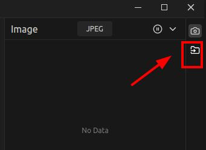
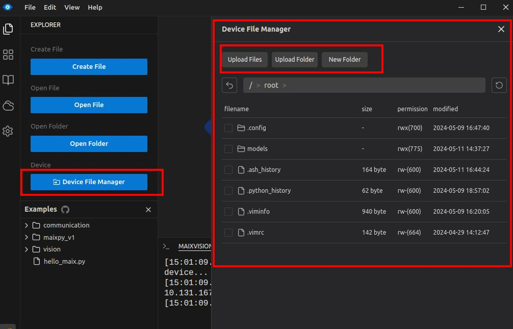

## 简介

[MaixVision](https://wiki.sipeed.com/maixvision) 是专为 Maix 生态打造的一款开发者编程工具，支持 MaixPy 编程和图形化积木编程，同时支持在线运行和调试，以及实时预览图像，可以同步设备显示屏的图像，方便调试和开发。

以及支持打包应用和安装应用到设备，方便用户一键生成、安装应用。

同时还集成一些方便开发的小工具，比如文件管理，阈值编辑器，二维码生成等等。

## 下载

访问 [MaixVision 主页](https://wiki.sipeed.com/maixvision) 下载。


## 使用 MaixPy 编程和在线运行

按照[快速开始](../README.md)的步骤连接设备，我们可以很方便地使用 MaixPy 编程和在线运行。

## 实时预览图像

MaixPy 提供`display`模块，可以将图像显示到屏幕上，同时，在调用`display`模块的`show`方法时，会将图像发送到 MaixVision 显示，比如代码：
```python
from maix import display, camera

cam = camera.Camera(640, 480)
disp = display.Display()
while 1:
    disp.show(cam.read())
```

这里我们用摄像头读取了图像，然后通过`disp.show()`方法将图像显示到屏幕上，同时也会发送到 MaixVision 显示。

当我们点击了右上角的`暂停`按钮，就会停止发送图像到 MaixVision 显示。


## 代码自动补全


代码提示依赖电脑本地的 Python 包，为了实现代码提示，我们需要在电脑中安装 Python，并且安装需要提示的 Python 包。

* 安装 Python 请访问 [Python 官网](https://python.org/)安装。
* 安装需要提示的包，比如对于 MaixPy， 你需要在电脑也安装一份 MaixPy 包，在电脑使用`pip install MaixPy`即可安装好，如果`MaixPy`更新了，你也需要在电脑和设备更新到`MaixPy`，电脑手动在终端执行`pip install MaixPy -U`即可，设备更新直接在`设置`应用中更新即可。
> 中国国内用户可以使用国内镜像`pip install -i https://pypi.tuna.tsinghua.edu.cn/simple MaixPy`。
* 重启 MaixVision 就能够看到代码提示了。
> 如果仍然不能提示，可以手动在设置中设置 python 可执行文件的路径后重启。

>! 注意在电脑安装 Python 包这里只是为了用作代码提示，实际代码运行还是在设备（开发板）上，设备上也要有对应的包才能正常运行。


> 另外，虽然你在电脑上安装了 MaixPy 包，但是由于我们精力有限，我们不确保你能直接在电脑的 Python 导入 maix 包进行使用，请在支持的设备上运行。


## 计算图像的直方图

在上一步中我们可以在 MaixVision 中实时看到图像，我们用鼠标框选一个区域，图像下方就能看到这个区域的直方图了，选择不同的颜色表示方法，可以看到不同的颜色通道的直方图。

这个功能方便我们在做某些图像处理算法时找到一些合适的参数。

## 区分`设备文件系统`和`电脑文件系统`

这里我们有一个比较重要的概念需要掌握：**分清楚`设备文件系统`和`电脑文件系统`**。
* **电脑文件系统**：运行在电脑上，在 MaixVision 中打开文件或者工程都是打开的电脑里面的文件，保存也是自动保存到电脑的文件系统。
* **设备文件系统**：程序运行时会将程序发送到设备上运行，所以代码里面使用的文件都是从设备文件系统读取。

所以常见的问题是有同学在电脑上保存了文件`D:\data\a.jpg`，然后在设备上使用这个文件`img = image.load("D:\data\a.jpg")`，这样当然是找不到文件的，因为设备上没有`D:\data\a.jpg`这个文件。

具体如何将电脑的文件发送到设备上，参考下面的章节。


## 传输文件到设备

先连接设备，然后点击浏览设备文件系统的按钮，有两个入口，如下图，然后就能上传文件到设备，或者从设备下载文件到电脑了。






.. details::也可以用其它工具代替，点击展开
    先知道设备的 ip 地址或者设备名称，MaixVision 就可以搜索到, 或者在设备`设置->系统信息`中看到，比如类似 `maixcam-xxxx.local` 或者 `192.168.0.123`。
    用户名和密码都是 `root`, 使用 `SFTP` 协议传输文件，端口号是 `22`。

    然后不同系统下都有很多好用的软件：

    ### Windows 下

    使用 [WinSCP](https://winscp.net/eng/index.php) 或者 [FileZilla](https://filezilla-project.org/) 等工具连接设备，将文件传输到设备上，选择 `SFTP` 协议填写设备和账号信息连接即可。

    具体不懂的可以自行搜索。

    ### Linux 下

    终端使用 `scp` 命令传输文件到设备上，比如：

    ```bash
    scp /path/to/your/file.py root@maixcam-xxxx.local:/root
    ```

    ### Mac 下

    * **方法一**：终端使用 `scp` 命令传输文件到设备上，比如：
    ```bash
    scp /path/to/your/file.py root@maixcam-xxxx.local:/root
    ```

    * **方法二**：使用 [FileZilla](https://filezilla-project.org/) 等工具连接设备，将文件传输到设备上，选择 `SFTP` 协议填写设备和账号信息连接即可。


## 使用图形化积木编程

开发中，敬请期待。

