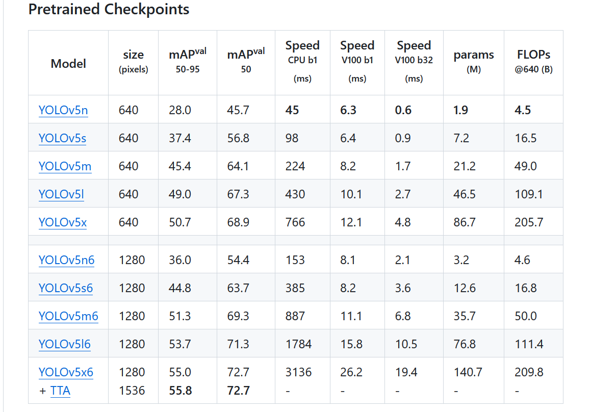
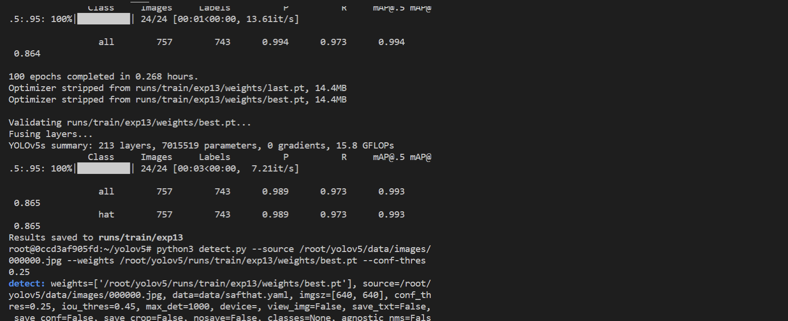
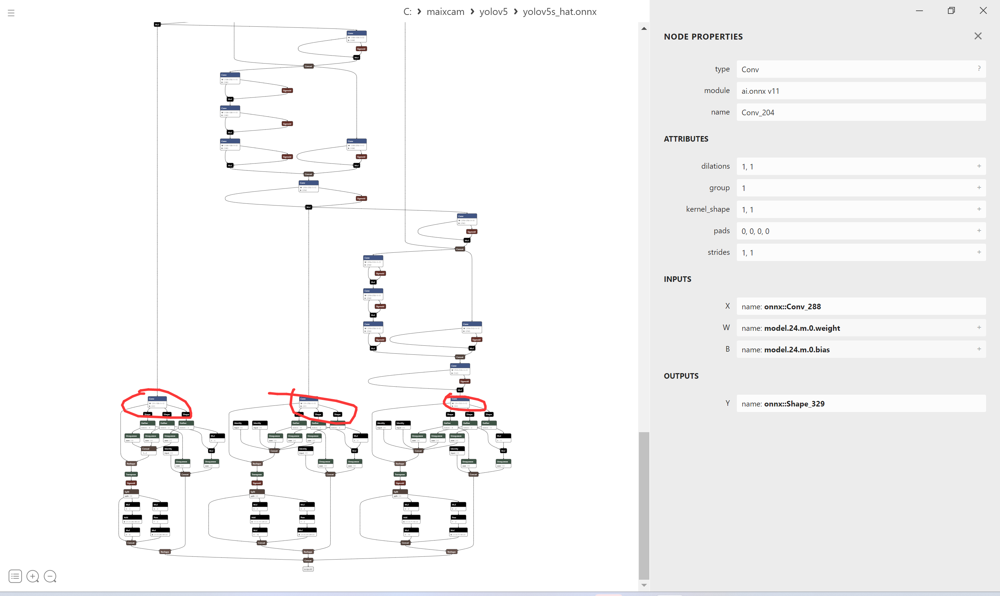

> 本文来自社区用户 dragonforward 的贡献

> 本博客将向你展示零基础一步步的部署好自己的yolov5s模型（博主展示的是安全帽模型），训练就引用我自己之前写过的，已经训练好的可以跳过该部分，其中有部分不一样。

## 获得自定义训练得到的yolov5s onnx模型

### 准备自定义数据集（博主用的是VOC数据集）

- `数据集目录结构`如下：
```
└─VOC2028:		自定义数据集
    ├─Annotations	存放的是数据集标签文件，xml格式
    ├─ImageSets		数据集的划分文件
    │  └─Main
    ├─JPEGImages	存放的是数据集图片
```


- `分割数据集`

在split_train_val.py文件路径下执行`python3 split_train_val.py`会得到一下目录结构：
```
└─VOC2028:		自定义数据集
    ├─Annotations	存放的是数据集标签文件，xml格式
    ├─ImageSets		数据集的划分文件
    │  └─Main test.txt
          └─test.txt
          └─train.txt
          └─val.txt
    ├─JPEGImages	存放的是数据集图片
    ├─split_train_val.py	分割数据集的py文件

```

`split_train_val.py文件代码如下`：

```
# -*- coding: utf-8 -*-
"""
Author:dragonforward
简介：分训练集、验证集和测试集，按照 8：1：1 的比例来分，训练集8，验证集1，测试集1
"""
import os
import random
import argparse

parser = argparse.ArgumentParser()
# xml文件的地址，根据自己的数据进行修改 xml一般存放在Annotations下
parser.add_argument('--xml_path', default='Annotations/', type=str, help='input xml label path')
# 数据集的划分，地址选择自己数据下的ImageSets/Main
parser.add_argument('--txt_path', default='ImageSets/Main/', type=str, help='output txt label path')
opt = parser.parse_args()

train_percent = 0.8  # 训练集所占比例
val_percent = 0.1    # 验证集所占比例
test_persent = 0.1   # 测试集所占比例

xmlfilepath = opt.xml_path
txtsavepath = opt.txt_path
total_xml = os.listdir(xmlfilepath)

if not os.path.exists(txtsavepath):
    os.makedirs(txtsavepath)

num = len(total_xml)  
list = list(range(num))

t_train = int(num * train_percent)  
t_val = int(num * val_percent)

train = random.sample(list, t_train)
num1 = len(train)
for i in range(num1):
    list.remove(train[i])


val_test = [i for i in list if not i in train]
val = random.sample(val_test, t_val)
num2 = len(val)
for i in range(num2):
    list.remove(val[i])


file_train = open(txtsavepath + '/train.txt', 'w')
file_val = open(txtsavepath + '/val.txt', 'w')
file_test = open(txtsavepath + '/test.txt', 'w')

for i in train:
    name = total_xml[i][:-4] + '\n'
    file_train.write(name)

for i in val:
    name = total_xml[i][:-4] + '\n'
    file_val.write(name)    

for i in list:
    name = total_xml[i][:-4] + '\n'
    file_test.write(name)
    
    
file_train.close()
file_val.close()
file_test.close()
```


- `voc转label得到label文件`

目录结构如下：
```
└─VOC2028:		自定义数据集
    ├─Annotations	存放的是数据集标签文件，xml格式
    ├─ImageSets		数据集的划分文件
    │  └─Main
    ├─JPEGImages	存放的是数据集图片
    └─labels		yolov5将此文件夹当作训练的标注文件夹
└─voc_label.py
```

`voc_label.py文件代码如下`：

```
# -*- coding: utf-8 -*-
import xml.etree.ElementTree as ET
import os

sets = ['train', 'val', 'test']  # 如果你的Main文件夹没有test.txt，就删掉'test'
classes = ["hat", "people"]   # 改成自己的类别，VOC数据集有以下20类别
# classes = ["brickwork", "coil","rebar"]   # 改成自己的类别，VOC数据集有以下20类别
# classes = ["aeroplane", 'bicycle', 'bird', 'boat', 'bottle', 'bus', 'car', 'cat', 'chair', 'cow', 'diningtable', 'dog',
#            'horse', 'motorbike', 'person', 'pottedplant', 'sheep', 'sofa', 'train', 'tvmonitor']  # class names
# abs_path = os.getcwd() /root/yolov5/data/voc_label.py 
abs_path = '/root/yolov5/data/'

def convert(size, box):
    dw = 1. / (size[0])
    dh = 1. / (size[1])
    x = (box[0] + box[1]) / 2.0 - 1
    y = (box[2] + box[3]) / 2.0 - 1
    w = box[1] - box[0]
    h = box[3] - box[2]
    x = x * dw
    w = w * dw
    y = y * dh
    h = h * dh
    return x, y, w, h


def convert_annotation(image_id):
    in_file = open(abs_path + '/VOC2028/Annotations/%s.xml' % (image_id), encoding='UTF-8')
    out_file = open(abs_path + '/VOC2028/labels/%s.txt' % (image_id), 'w')
    tree = ET.parse(in_file)
    root = tree.getroot()
    size = root.find('size')
    w = int(size.find('width').text)
    h = int(size.find('height').text)
    for obj in root.iter('object'):
        difficult = obj.find('difficult').text
        # difficult = obj.find('Difficult').text
        cls = obj.find('name').text
        if cls not in classes or int(difficult) == 1:
            continue
        cls_id = classes.index(cls)
        xmlbox = obj.find('bndbox')
        b = (float(xmlbox.find('xmin').text), float(xmlbox.find('xmax').text), float(xmlbox.find('ymin').text),
             float(xmlbox.find('ymax').text))
        b1, b2, b3, b4 = b
        # 标注越界修正
        if b2 > w:
            b2 = w
        if b4 > h:
            b4 = h
        b = (b1, b2, b3, b4)
        bb = convert((w, h), b)
        out_file.write(str(cls_id) + " " + " ".join([str(a) for a in bb]) + '\n')


for image_set in sets:
    if not os.path.exists(abs_path + '/VOC2028/labels/'):
        os.makedirs(abs_path + '/VOC2028/labels/')

    image_ids = open(abs_path + '/VOC2028/ImageSets/Main/%s.txt' % (image_set)).read().strip().split()
    list_file = open(abs_path + '/VOC2028/%s.txt' % (image_set), 'w')
    for image_id in image_ids:
        list_file.write(abs_path + '/VOC2028/JPEGImages/%s.jpg\n' % (image_id))  # 要么自己补全路径，只写一半可能会报错
        convert_annotation(image_id)
    list_file.close()


```
 

 

### 训练模型


- 配置环境
```
git clone https://github.com/ultralytics/yolov5
cd yolov5
pip install -r requirements.txt
pip install onnx
```


- 下载预训练权重（博主尝试了v7.0的和v6.0的pt都可以）
```
https://github.com/ultralytics/yolov5/releases/download/v7.0/yolov5s.pt
```


 

- 训练（博主使用的是学校的集群进行训练）


```
python3 train.py --weights weights/yolov5s.pt --cfg models/yolov5s.yaml --data data/safthat.yaml --epochs 150 --batch-size 16 --multi-scale --device 0 
```

 


```
python3 detect.py --source /root/yolov5/data/images/000000.jpg --weights /root/yolov5/runs/train/exp13/weights/best.pt --conf-thres 0.25
```
  


- 导出onnx模型，由于学校服务器目前去教学上课去了，他们上完课才能分配我就用电脑本机的conda环境导出
下面为啥使用`-imgsz 224 320`,原因就是比较适配屏幕，加上我尝试640*640的，摄像头报错，提示是640*480这样，然后我就看到sipeed那个yolov5s是320*224的，我也就和他保持一致吧
```
python export.py --weights yolov5s_hat.pt --include onnx --opset 16 --imgsz 224 320
```

 

模型查看通过网址输入netron.app查看三个输出：

 

下面是博主的三个输出
```
onnx::Shape_329
onnx::Shape_384
onnx::Shape_439
```

## 模型转化（关键）

### 安装docker环境（已安装过的可以跳过）
```
安装docker依赖的基础软件
sudo apt-get update
sudo apt-get install apt-transport-https ca-certificates curl gnupg-agent software-properties-common
添加官方来源
curl -fsSL https://download.docker.com/linux/ubuntu/gpg | sudo apt-key add -
sudo add-apt-repository "deb [arch=amd64] https://download.docker.com/linux/ubuntu $(lsb_release -cs) stable"
安装 docker
sudo apt-get update
sudo apt-get install docker-ce docker-ce-cli containerd.io
```

### 开始量化模型实操（！！！）

### 准备工作
```
https://github.com/sophgo/tpu-mlir/releases/tag/v1.7
上面网址下载
tpu-mlir-resource.tar 和 tpu_mlir-1.7-py3-none-any.whl 
```
  

为什么拉取最新版，因为我用3.1版本失败了，工具在一直更新，最好保持最新，可以看下面图片我使用3.1版本也试过

 

```

docker pull sophgo/tpuc_dev:latest

进入容器后将上面的准备的两个文件拷贝到workspace目录

root@3d517bc7f51f:/workspace/model_yolov5s# cd ..
root@3d517bc7f51f:/workspace# ls
model_yolov5s  tpu-mlir-resource  tpu-mlir-resource.tar  tpu_mlir-1.7-py3-none-any.whl
root@3d517bc7f51f:/workspace# 

下面两个二选一，我建议是第二个，离线安装
pip install tpu_mlir[all]或者pip install tpu_mlir-*-py3-none-any.whl[all]
博主是选的第二个
pip install tpu_mlir-1.7-py3-none-any.whl
以及安装它的全部依赖
pip install tpu_mlir-1.7-py3-none-any.whl[all] 
解压
tar -xvf tpu-mlir-resource.tar
修改文件夹名字
mv regression/ tpu-mlir-resource/


mkdir model_yolov5s && cd model_yolov5s

cp -rf ../tpu_mlir_resource/dataset/COCO2017 .
cp -rf ../tpu_mlir_resource/image .


把之前准备好的图片100张一集一张测试图片和onnx模型传递到如下
root@3d517bc7f51f:/workspace# cd model_yolov5s/
root@3d517bc7f51f:/workspace/model_yolov5s# ls
COCO2017  image  workspace  yolov5n_hat.onnx  yolov5s_hat.onnx
root@3d517bc7f51f:/workspace/model_yolov5s# cd COCO2017/
root@3d517bc7f51f:/workspace/model_yolov5s/COCO2017# ls
000000.jpg  000011.jpg  000022.jpg  000032.jpg  000042.jpg  000053.jpg  000066.jpg  000076.jpg  000086.jpg  000096.jpg
000002.jpg  000012.jpg  000023.jpg  000033.jpg  000043.jpg  000054.jpg  000067.jpg  000077.jpg  000087.jpg  000101.jpg
000003.jpg  000013.jpg  000024.jpg  000034.jpg  000044.jpg  000055.jpg  000068.jpg  000078.jpg  000088.jpg  000102.jpg
000004.jpg  000014.jpg  000025.jpg  000035.jpg  000045.jpg  000058.jpg  000069.jpg  000079.jpg  000089.jpg  000103.jpg
000005.jpg  000015.jpg  000026.jpg  000036.jpg  000046.jpg  000059.jpg  000070.jpg  000080.jpg  000090.jpg  000104.jpg
000006.jpg  000016.jpg  000027.jpg  000037.jpg  000048.jpg  000061.jpg  000071.jpg  000081.jpg  000091.jpg  000105.jpg
000007.jpg  000017.jpg  000028.jpg  000038.jpg  000049.jpg  000062.jpg  000072.jpg  000082.jpg  000092.jpg  000106.jpg
000008.jpg  000019.jpg  000029.jpg  000039.jpg  000050.jpg  000063.jpg  000073.jpg  000083.jpg  000093.jpg  000107.jpg
000009.jpg  000020.jpg  000030.jpg  000040.jpg  000051.jpg  000064.jpg  000074.jpg  000084.jpg  000094.jpg  000108.jpg
000010.jpg  000021.jpg  000031.jpg  000041.jpg  000052.jpg  000065.jpg  000075.jpg  000085.jpg  000095.jpg  000109.jpg
root@3d517bc7f51f:/workspace/model_yolov5s/COCO2017# ls -l | grep "^-" | wc -l
100
root@3d517bc7f51f:/workspace/model_yolov5s/COCO2017# 

ls -l | grep "^-" | wc -l可以查看一下图片多少个，COCO2017文件下的图片博主替换了安全帽的100张图片以及测试图片同样

回到 model_yolov5s
root@3d517bc7f51f:/workspace/model_yolov5s/COCO2017# cd ..
root@3d517bc7f51f:/workspace/model_yolov5s# ls
COCO2017  image  workspace  yolov5n_hat.onnx  yolov5s_hat.onnx
root@3d517bc7f51f:/workspace/model_yolov5s# 

接着
mkdir workspace && cd workspace
执行下面命令ONNX 转 MLIR（记得output_names换为自己的）
model_transform \
--model_name yolov5s \
--model_def ../yolov5s_hat.onnx \
--input_shapes [[1,3,224,320]] \
--mean 0.0,0.0,0.0 \
--scale 0.0039216,0.0039216,0.0039216 \
--keep_aspect_ratio \
--pixel_format rgb \
--output_names onnx::Shape_329,onnx::Shape_439,onnx::Shape_384 \
--test_input ../image/hat.jpg \
--test_result yolov5s_top_outputs.npz \
--mlir yolov5s.mlir

执行下面命令MLIR 转 INT8 模型，转 INT8 模型前需要跑 calibration, 得到校准表
run_calibration yolov5s.mlir \
--dataset ../COCO2017 \
--input_num 100 \
-o yolov5s_cali_table
接着执行下面
model_deploy \
--mlir yolov5s.mlir \
--quantize INT8 \
--calibration_table yolov5s_cali_table \
--processor cv181x \
--test_input yolov5s_in_f32.npz \
--test_reference yolov5s_top_outputs.npz \
--tolerance 0.85,0.45 \
--model yolov5s_cv181x_int8_sym.cvimodel

最后你会得到如下：
root@3d517bc7f51f:/workspace/model_yolov5s/workspace# ls
_weight_map.csv          yolov5s_cv181x_int8_sym.cvimodel         yolov5s_origin.mlir
build_flag.json          yolov5s_cv181x_int8_sym_final.mlir       yolov5s_top_f32_all_origin_weight.npz
final_opt.onnx           yolov5s_cv181x_int8_sym_tensor_info.txt  yolov5s_top_f32_all_weight.npz
yolov5s.mlir             yolov5s_cv181x_int8_sym_tpu.mlir         yolov5s_top_outputs.npz
yolov5s_cali_table       yolov5s_in_f32.npz                       yolov5s_tpu_addressed_cv181x_int8_sym_weight.npz
yolov5s_cv181x_int8_sym  yolov5s_opt.onnx.prototxt                yolov5s_tpu_addressed_cv181x_int8_sym_weight_fix.npz
root@3d517bc7f51f:/workspace/model_yolov5s/workspace# 
```
通过上述步骤，你就可以得到量化后的可以部署到开发板上的模型的
解答：
上面为什么会是cv181x，因为我自己先用了一个实验了一下，然后报错如下：
```
-- [I] load cvimodel from: /root/models/yolov5n.cvimodel
cvimodel built for cv180x CANNOT run on platform cv181x
failed to parse cvimodel

```


### 实机运行

- `yolov5s_hat.mud内容如下`如下：
```
[basic]
type = cvimodel
model = yolov5s_hat_cv181x_int8_sym.cvimodel

[extra]
model_type = yolov5
input_type = rgb
mean = 0, 0, 0
scale = 0.00392156862745098, 0.00392156862745098, 0.00392156862745098
anchors = 10,13, 16,30, 33,23, 30,61, 62,45, 59,119, 116,90, 156,198, 373,326
labels = hat,person

```
运行代码
```
from maix import camera, display, image, nn, app

detector = nn.YOLOv5(model="/root/models/yolov5s_hat.mud")
cam = camera.Camera(detector.input_width(), detector.input_height(), detector.input_format())
dis = display.Display()
print("www")
print(detector.input_width(),detector.input_height(), detector.input_format())

while not app.need_exit():
    img = cam.read()
    objs = detector.detect(img, conf_th = 0.5, iou_th = 0.45)
    for obj in objs:
        img.draw_rect(obj.x, obj.y, obj.w, obj.h, color = image.COLOR_RED)
        msg = f'{detector.labels[obj.class_id]}: {obj.score:.2f}'
        img.draw_string(obj.x, obj.y, msg, color = image.COLOR_RED)
    dis.show(img)
```

 

其中10.84.117.1就是ip地址，将cvmodel和mud上传到`/root/models/` 路径下

 

打包完成后安装应用然后运行就行，也可以ide运行


 


视频链接：
```
https://www.bilibili.com/video/BV1xz421S7Rx/?spm_id_from=333.999.0.0&vd_source=b1fff0f773136d7d05331087929c7739
```


## 感谢
感谢`谁说现在是冬天呢 `一些思路