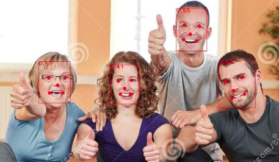

## 简介

人脸检测在很多地方都能用到，比如是为人脸识别提供人脸检测这一步骤，或者是人脸跟踪相关的应用等等。

这里提供的人脸检测不光可以检测到人脸，还能检测到 5 个关键点，包括两个眼睛，一个鼻子，一张嘴巴的两个嘴角。




## MaixPy 中使用人脸检测

MaixPy 官方提供了两种人脸检测模型，分别来自开源项目 [face detector 1MB with landmark](https://github.com/biubug6/Face-Detector-1MB-with-landmark) 和 [Retinafate](https://github.com/biubug6/Pytorch_Retinaface)。

要使用需要先下载模型，选择一个即可，两者区别不大：
* [face detector 1MB with landmark](https://maixhub.com/model/zoo/377)
* [Retinafate](https://maixhub.com/model/zoo/378)

然后拷贝模型文件到设备，拷贝方法见 [MaixVision 使用](../basic/maixvision.md)。
> 默认镜像里面有一个文件，可以直接使用，如果没有则需要你自己下载，而且下载的压缩包里面有多个分辨率可以选择，分辨率越高越精准但耗时更长

然后执行代码，这里有一行被注释了代码是加载`Retinafae`模型，根据你下载的模型选择使用哪一行代码

> 本功能需要 MaixPy >= 4.1.4 才能使用


```python
from maix import camera, display, image, nn, app
import math


detector = nn.FaceDetector(model="/root/models/face_detector.mud")
# detector = nn.Retinaface(model="/root/models/retinaface.mud")

cam = camera.Camera(detector.input_width(), detector.input_height(), detector.input_format())
dis = display.Display()

while not app.need_exit():
    img = cam.read()
    objs = detector.detect(img, conf_th = 0.4, iou_th = 0.45)
    for obj in objs:
        img.draw_rect(obj.x, obj.y, obj.w, obj.h, color = image.COLOR_RED)
        radius = math.ceil(obj.w / 10)
        img.draw_keypoints(obj.points, image.COLOR_RED, size = radius if radius < 5 else 4)
    dis.show(img)

```


