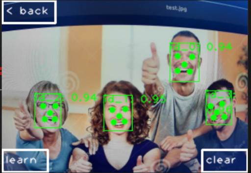

## 人脸识别简介



人脸识别就是识别当前画面中的人脸的位置以及是谁。
所以人脸识别除了要检测到人脸，一般会有一个库来保存认识的人和不认识的人。

## 识别原理

* 使用 AI 模型检测人脸，获得坐标和五官的坐标。
* 利用五官的坐标仿射变换将图中的脸拉正对其到标准脸的样子，方便模型提取脸的特征。
* 使用特征提取模型提取脸的特征值。
* 与库中记录的人脸特征值进行对比（计算保存的和当前画面中的脸的特征值的余弦距离，得出最小的距离的库中的人脸，小于设定的阈值就认为当前画面中就是这个库中的人）


## MaixPy 使用

MaixPy maix.nn 模块中提供了人脸识别的 API， 可以直接使用，模型也内置了，也可以到 [MaixHub 模型库](https://maixhub.com/model/zoo) 下载（筛选选则对应的硬件平台，比如 maixcam）。


识别：

```python
from maix import nn, camera, display, image
import os
import math

recognizer = nn.FaceRecognizer(detect_model="/root/models/yolov8n_face.mud", feature_model = "/root/models/insghtface_webface_r50.mud", dual_buff=True)
# recognizer = nn.FaceRecognizer(detect_model="/root/models/retinaface.mud", feature_model = "/root/models/face_feature.mud", dual_buff=True)

if os.path.exists("/root/faces.bin"):
    recognizer.load_faces("/root/faces.bin")
cam = camera.Camera(recognizer.input_width(), recognizer.input_height(), recognizer.input_format())
disp = display.Display()

while 1:
    img = cam.read()
    faces = recognizer.recognize(img, 0.5, 0.45, 0.85)
    for obj in faces:
        img.draw_rect(obj.x, obj.y, obj.w, obj.h, color = image.COLOR_RED)
        radius = math.ceil(obj.w / 10)
        img.draw_keypoints(obj.points, image.COLOR_RED, size = radius if radius < 5 else 4)
        msg = f'{recognizer.labels[obj.class_id]}: {obj.score:.2f}'
        img.draw_string(obj.x, obj.y, msg, color = image.COLOR_RED)
    disp.show(img)
```

第一次运行这个代码会发现能检测到人脸，但是都不认识，需要我们进入添加人脸模式学习人脸才行。

> 这里 `recognizer.labels[0]` 默认就是`unknown`，后面每添加一个人脸就会自动给 `labels` 增加一个。

比如可以在用户按下按键的时候学习人脸：
```python
faces = recognizer.recognize(img, 0.5, 0.45, 0.85, True)
for face in faces:
    print(face)
    # 这里考虑到了一个画面中有多个人脸的情况， obj.class_id 为 0 代表是没有录入的人脸
    # 这里写你自己的逻辑
    #   比如可以在这里根据 face 的 class_id 和坐标决定要不要添加到库里面，以及可以做用户交互逻辑，比如按下按钮才录入等
    recognizer.add_face(face, label) # label 是要给人脸取的标签（名字）
recognizer.save_faces("/root/faces.bin")
```

这里 `0.5` 是检测人脸的阈值,越大越严格, `0.45`是`IOU`阈值,用来过滤多个重合的人脸结果；
`0.85`是人脸对比阈值, 即和库中存好的人脸对比相似度,某个人脸对比分数大于这个阈值就认为是这个人。值越大过滤效果越好，值越小越容易误识别，可以根据实际情况调整。

检测模型这里支持`yolov8n_face`/`retinaface`/`face_detector`三种，速度和精度略微区别，可以根据实际情况选择使用。

## 完整例程

这里提供一个按键录入未知人脸，以及人脸识别的例程，可以在[MaixPy 的 example 目录](https://github.com/sipeed/MaixPy/tree/main/examples) 找到`nn_face_recognize.py`。


## dual_buff 双缓冲区加速

你可能注意到这里模型初始化使用了`dual_buff`（默认值就是 `True`），使能 `dual_buff` 参数可以加快运行效率，提高帧率，具体原理和使用注意点见 [dual_buff 介绍](./dual_buff.md)。

## 更换其它默认识别模型

这里识别模型（区分不同人）用了 `mobilenetv2` 和 [insight face resnet50](https://maixhub.com/model/zoo/462) 模型，如果不满足精度要求，可以更换成其它模型，需要自己训练或者找其它训练好的模型转换成 MaixCAM 支持的模型即可，比如 [insightface](https://github.com/deepinsight/insightface)的其它模型， 转换方法看[MaixCAM 模型转换文档](../ai_model_converter/maixcam.md)， mud 文件参考以有的文件写即可。


