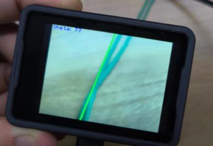

阅读本文前，确保已经知晓如何开发MaixCAM，详情请阅读[快速开始](../README.md)

## 简介

在视觉应用中，在巡迹小车、巡线机器人等应用中经常需要寻找线条的功能。本文将介绍:

- 如何使用MaixPy来实现巡线功能

- 如何使用MaixCam的默认应用程序巡线


## 如何使用MaixPy来寻找直线

MaixPy的 `maix.image.Image`中提供了`get_regression`方法来寻找直线

### 代码示例

一个简单的示例，实现寻找并画出直线

```python
from maix import camera, display, image

cam = camera.Camera(320, 240)
disp = display.Display()

# thresholds = [[0, 80, 40, 80, 10, 80]]      # red
thresholds = [[0, 80, -120, -10, 0, 30]]    # green
# thresholds = [[0, 80, 30, 100, -120, -60]]  # blue

while 1:
    img = cam.read()

    lines = img.get_regression(thresholds, area_threshold = 100)
    for a in lines:
        img.draw_line(a.x1(), a.y1(), a.x2(), a.y2(), image.COLOR_GREEN, 2)
        theta = a.theta()
        rho = a.rho()
        if theta > 90:
            theta = 270 - theta
        else:
            theta = 90 - theta
        img.draw_string(0, 0, "theta: " + str(theta) + ", rho: " + str(rho), image.COLOR_BLUE)

    disp.show(img)
```

步骤：

1. 导入image、camera、display模块

   ```python
   from maix import image, camera, display
   ```

2. 初始化摄像头和显示

   ```python
   cam = camera.Camera(320, 240)	# 初始化摄像头，输出分辨率320x240 RGB格式
   disp = display.Display()
   ```

3. 从摄像头获取图片并显示

   ```python
   while 1:
       img = cam.read()
       disp.show(img)
   ```

4. 调用`get_regression`方法寻找摄像头图片中的直线，并画到屏幕上

   ```python
   lines = img.get_regression(thresholds, area_threshold = 100)
   for a in lines:
      img.draw_line(a.x1(), a.y1(), a.x2(), a.y2(), image.COLOR_GREEN, 2)
      theta = a.theta()
      rho = a.rho()
      if theta > 90:
         theta = 270 - theta
      else:
         theta = 90 - theta
      img.draw_string(0, 0, "theta: " + str(theta) + ", rho: " + str(rho), image.COLOR_BLUE)
   ```

   - `img`是通过`cam.read()`读取到的摄像头图像，当初始化的方式为`cam = camera.Camera(320, 240)`时，`img`对象是一张分辨率为320x240的RGB图。
   - `img.get_regression`用来寻找直线， `thresholds` 是一个颜色阈值列表，每个元素是一个颜色阈值，同时找到多个阈值就传入多个，每个颜色阈值的格式为 `[L_MIN, L_MAX, A_MIN, A_MAX, B_MIN, B_MAX]`，这里的 `L`、`A`、`B` 是`LAB`颜色空间的三个通道，`L` 通道是亮度，`A` 通道是红绿通道，`B` 通道是蓝黄通道。`pixels_threshold`是一个像素面积的阈值，用来过滤一些不需要直线。
   - `for a in lines`用来遍历返回的`Line`对象， 其中`a`就是当前的`Line`对象。通常`get_regression`函数只会返回一个`Line`对象，如果需要寻找多条直线，可以尝试使用`find_line`方法
   - 使用`img.draw_line`来画出找到的线条，`a.x1(), a.y1(), a.x2(), a.y2()`分别代表直线两端的坐标
   - 使用`img.draw_string`在左上角显示直线与x轴的夹角， `a.theta()`是直线与y轴的夹角， 这里为了方便理解转换成直线与x轴的夹角`theta`，`a.rho()`是原点与直线的垂线的长度.

5. 通过maixvision运行代码，就可以寻线啦，看看效果吧

   

### 常用参数说明

列举常用参数说明，如果没有找到可以实现应用的参数，则需要考虑是否使用其他算法实现，或者基于目前算法的结果扩展所需的功能

| 参数             | 说明                                                         | 示例                                                         |
| ---------------- | ------------------------------------------------------------ | ------------------------------------------------------------ |
| thresholds       | 基于lab颜色空间的阈值，threshold=[[l_min, l_max, a_min, a_max, b_min, b_max]]，分别表示：<br />亮度范围为[l_min, l_max]\|<br />绿色到红色的分量范围为[a_min, a_max]<br />蓝色到黄色的分量范围为[b_min, b_max]<br />可同时设置多个阈值 | 设置两个阈值来检测红色和绿色<br />```img.find_blobs(threshold=[[0, 80, 40, 80, 10, 80], [0, 80, -120, -10, 0, 30]])```<br />红色阈值为[0, 80, 40, 80, 10, 80]<br />绿色阈值为[0, 80, -120, -10, 0, 30] |
| invert           | 使能阈值反转，使能后传入阈值与实际阈值相反，默认为False      | 使能阈值反转<br />```img.find_blobs(invert=True)```          |
| roi              | 设置算法计算的矩形区域，roi=[x, y, w, h]，x，y表示矩形区域左上角坐标，w，h表示矩形区域的宽度和高度，默认为整张图片 | 计算坐标为(50,50)，宽和高为100的区域<br />```img.find_blobs(roi=[50, 50, 100, 100])``` |
| area_threshold   | 过滤像素面积小于area_threshold的直线，单位为像素点，默认为10。该参数可用于过滤一些无用的小直线 | 过滤面积小于1000的直线<br />```img.find_blobs(area_threshold=1000)``` |
| pixels_threshold | 过滤有效像素点小于pixels_threshold的直线，默认为10。该参数可用于过滤一些无用的小直线 | 过滤有效像素点小于1000的直线<br />```img.find_blobs(pixels_threshold=1000)``` |

本文介绍常用方法，更多 API 请看 API 文档的 [image](../../../api/maix/image.md) 部分。

### 提升巡线的速度

这里提供几个提升巡线速度的方法

1. 选择合适的分辨率

   越大的分辨率计算速度越慢，可以根据识别距离和精度的要求来选择更合适的分辨率

2. 使用灰度图识别

   使用灰度图识别时，算法只会处理一个通道，有更快的识别速度，在颜色单一的环境会很有用。注意此时向`get_regression`传入`thresholds`时，只有`l_min`和`l_max`有效。

   获取灰度图的方法：

   ```python
   # 方法1
   cam = camera.Camera(320, 240， image.Format.FMT_GRAYSCALE)    # MaixPy v4.2.1后支持
   gray_img = cam.read()										# 获取灰度图
   
   # 方法2
   cam = camera.Camera(320, 240)
   img = cam.read()
   gray_img = img.to_format(image.Format.FMT_GRAYSCALE)			# 获取灰度图
   ```

## 如何使用MaixCam的默认应用程序寻找直线

为了快速验证寻找直线的功能，可以先使用MaixCam提供的`line_tracking`应用程序来体验寻找直线的效果。

### 使用方法
1. 选择并打开`Line tracking`应用
2. 点击屏幕中需要识别的直线，左侧会显示该直线的颜色
3. 点击左侧（界面中`L A B`下方的颜色）需要检测的颜色
4. 此时就可以识别到对应的直线了，同时串口也会输出直线的坐标和角度信息。

### 演示

<video src="/static/video/line_tracking_app.mp4" controls="controls" width="100%" height="auto"></video>

### 进阶操作

#### 手动设置LAB阈值寻找直线

APP提供手动设置LAB阈值来精确的寻找直线

操作方法：

1. `点击`左下角`选项图标`，进入配置模式

2. 将`摄像头对准`需要`寻找的物体`，`点击`屏幕上的`目标直线`，此时界面中`L A B`下方会显示该物体对应颜色的`矩形框`，并显示该物体颜色的`LAB值`。

3. 点击下方选项`L Min，L Max，A Min，A Max，B Min，B Max`，点击后右侧会出现滑动条来设置该选项值。这些值分别对应LAB颜色格式的L通道、A通道和B通道的最小值和最大值

4. 参考步骤2计算的物体颜色的`LAB值`，将`L Min，L Max，A Min，A Max，B Min，B Max`调整到合适的值，即可识别到对应的直线。

   例如`LAB=(20, 50, 80)`，由于`L=20`，为了适配一定范围让`L Min=10`，`L Max=30`;同理，由于`A=50`，让`A Min=40`，`A Max=60`; 由于`B=80`，让`B Min=70`，`B Max=90`。

#### 通过串口协议获取检测数据

寻找直线应用支持通过串口（默认波特率为115200）上报检测到的直线信息。

由于上报信息只有一条，这里直接用示例来说明上报信息的内容。

例如上报信息为：

```shell
AA CA AC BB 0E 00 00 00 E1 09 FC 01 01 00 E9 01 6F 01 57 00 C1 C6
```

- `AA CA AC BB`：协议头部，内容固定
- `0E 00 00 00`：数据长度，除了协议头部和数据长度外的总长度，这里表示长度为14
- `E1`：标志位，用来标识串口消息标志
- `09`：命令类型，对于寻找直线APP应用该值固定为0x09
- `FC 01 01 00 E9 01 6F 01 57 00`：直线的两端坐标和角度信息，每个值用小端格式的2字节表示。`FC 01`和`01 00`表示第一个端点坐标为(508, 1)，`E9 01`和`6F 01`表示第二个端点坐标为(489, 367)，`57 00`表示直线与x轴的角度为87度

- ` C1 C6`：CRC 校验值，用以校验帧数据在传输过程中是否出错


